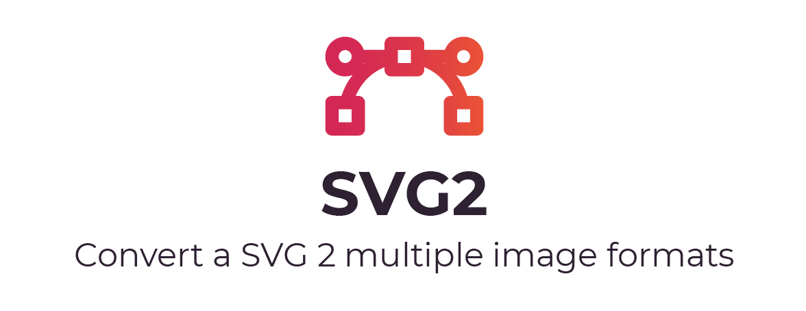

[](https://github.com/oslllo/svg2/actions/workflows/ci.test.yml)
[](https://www.npmjs.com/package/oslllo-svg2)
[](https://coveralls.io/github/oslllo/svg2?branch=master)

## 🎉 v1.0.0 Removed `Canvas & JSDOM` no more slow `npm install` cycles.

## Documentation, Installation, and Usage Instructions

See the full installation and usage documentation [HERE](https://docs.oslllo.com/svg2/master/).

## The Objective

I wanted to convert `SVGs` into diffrent image formats.

## The Problem / Why

Converting a `SVG` into an image turns out to not be a simple and straight forward as it may seem. Multiple packages already exist on `NPM` but they all come with a few caveats (that i don't like).

- Some use `puppeteer` which requires you to download a browser like chromium **(130mb download)**
- Some do not support `Node` **(work in browsers only)**
- Some support `CLI` only.
- Some only convert to `png`

---

### Usage Examples

#### Convert a SVG2 `png` and save to path (promise)

```js
const Svg2 = require("oslllo-svg2");

Svg2("path/to/svg/example.svg")
  .png()
  .toFile("path/to/save/example.png")
  .then(() => {
    console.log("done");
  })
  .catch((error) => {
    throw error;
  });
```

#### Convert a SVG2 `png` and save to path (callback)

```js
const Svg2 = require("oslllo-svg2");

Svg2("path/to/svg/example.svg")
  .png()
  .toFile("path/to/save/example.png", (err) => {
    if (err) {
      throw err;
    } else {
      console.log("done");
    }
  });
```

---
